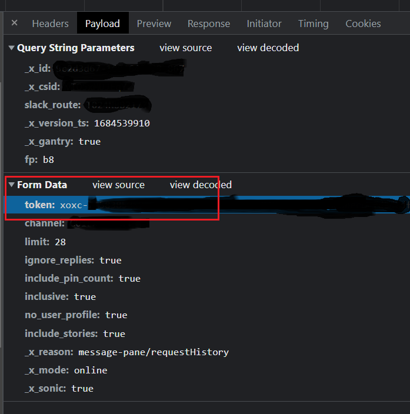
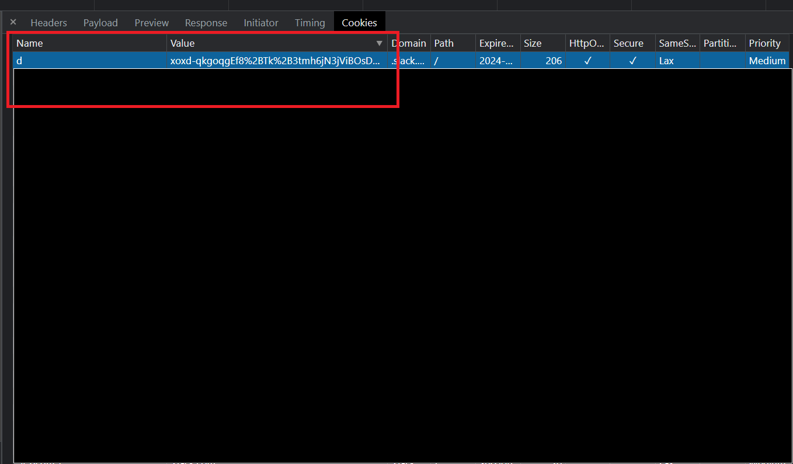

slack-scraper
=============

Python module/scripts to download threads and messages from Slack channels

CLI
---

`slack-scraper.py` allows downloading of Slack messages and their threaded replies (optionally)
to the standard output.

	$ slack-scraper.py --token $SLACK_API_TOKEN --dcookie $SLACK_API_DCOOKIE --days 31 <channel_name>

About Slack Tokens
------------------

There are two ways of supplying Slack authentication credentials:

* Use a bot token and populate SLACK_API_TOKEN using it. In this case the dcookie is not required. However one has to create a Slack app to get a bot token and that is not always possible if one is not an administrator

* Use personal tokens. In order to do this:

  - Launch Slack within your browser (say Chrome).
  - Open Developer Tools in the Chrome browser.
  - Open the Network tab in Developer Tools.
  - Browse Slack (example: click on a channel).
  - Come back to the Network Tab and click on any Slack API call (example `conversations.history`).
  - Inspect the request headers of this call.
  - The token is one of the headers. This becomes the value of SLACK_API_TOKEN. Screenshot below:
  

  - From the cookies - find the d=....; part - and copy	the value of the d cookie.This becomes the value of SLACK_API_DCOOKIE
    

